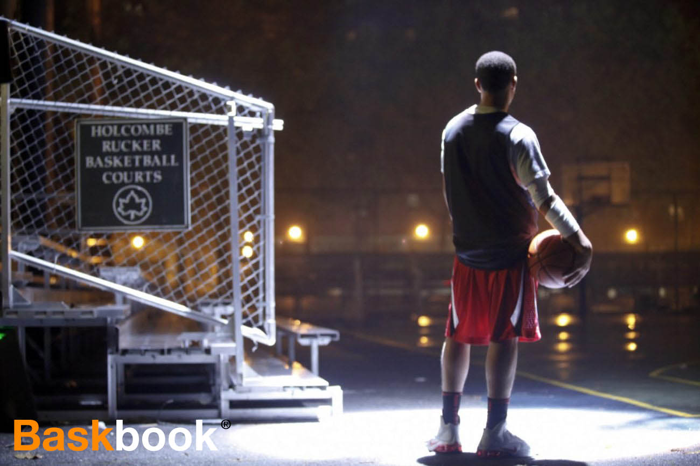

## Descripcion del Proyecto :

El proyecto consistira en el desarrollo de una Red Social enfocada a deportes,
para esto se creara de tal forma de que pueda ser usada para cualquier tipo de
deporte, aunque de principo este enfocada a la NBA, y en donde se puedan ver
analisis, calendarios, eventos importantes y ademas los usuarios puedan añadir sus
propias publicaciones, tomando en cuenta la seguridad, autenticación ,
autorización , login y en la medida de lo posible usar las novedades y patrones de
diseños de modo de profundizar conocimientos ( JWT , Servicios , Bases de Datos no
Relacionales , APIS ... ).

## Tecnologias a usar :

Para la parte del desarrollo se usara algun Stack de javascript (MEAN , MERN , MEVN ) e implementando una infrastructura de microservicios :

Por la parte de Cliente :
- React.

Por la parte de lado del Servidor: 

- Node.js y Express
- MongoDB
- Mongoose

Por la parte de Diseño de Interfaces :

- CSS
- Bootstrap

Por la parte del Despliegue :

- GIT & GITHUB
- Dockers

Entregables:

- Memoria final del proyecto
- Código software desarrollado

## Comandos Utiles :

- npm start : Inicia la aplicacion.
- npm install : Instala las dependencias de la aplicacion.
- npm test : Corre el plan de prueba y genera un resumen en la carpeta de test.

